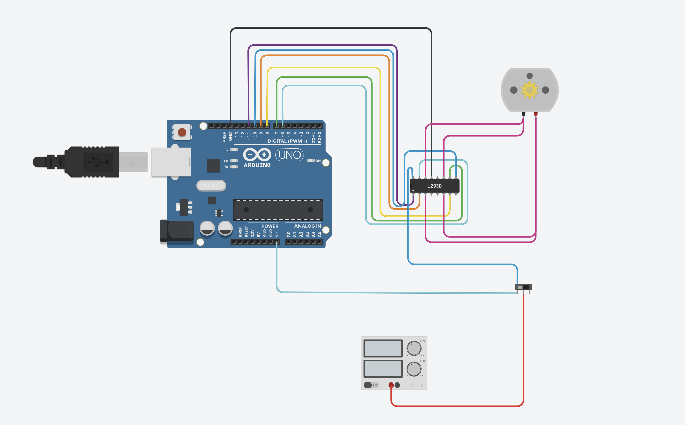
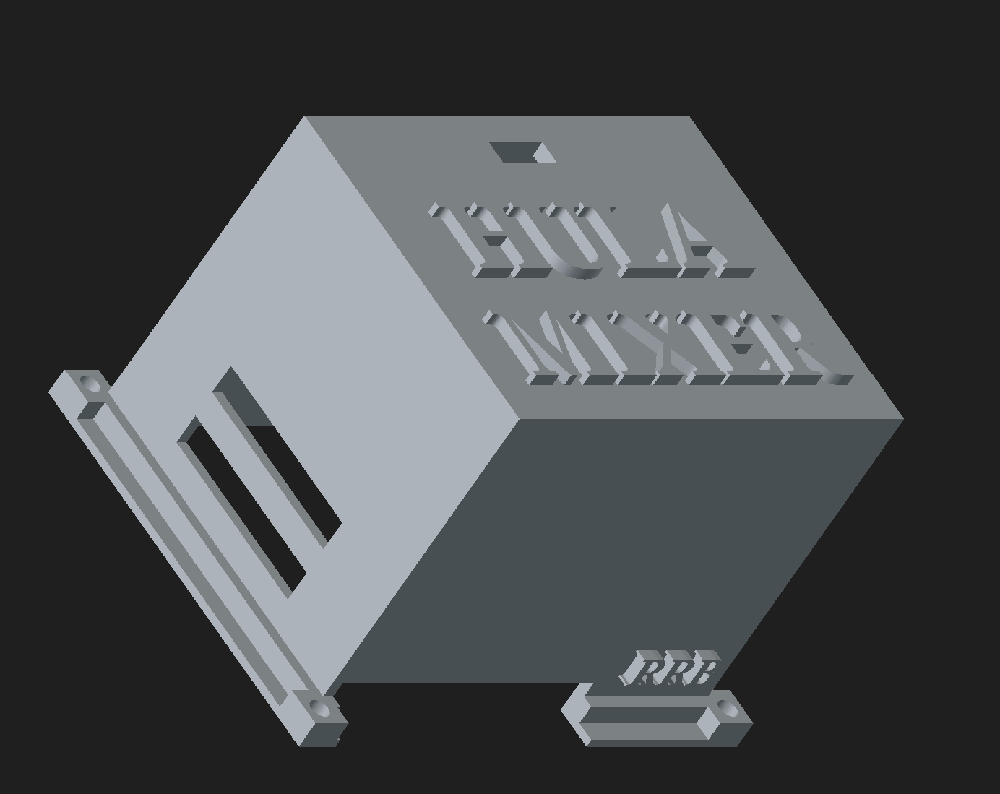
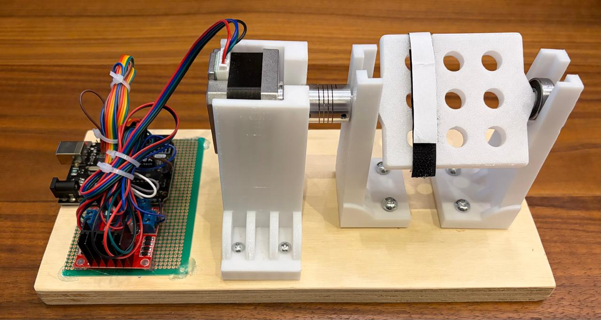

# Hula Mixer

Low-cost lab mixer built with Arduino Uno, L298N, and a NEMA17 stepper motor.

## Overview

DIY rotary mixer designed as a cost-effective alternative to commercial lab mixers. Built around an Arduino Uno controlling a NEMA17 stepper motor through an L298N driver, with a rocker switch for power control.

## Status

🔧 In progress — motor control validated, working on perfboard assembly and enclosure design.

## Components

- Arduino Uno R3
- L298N motor driver
- NEMA17 stepper motor (17HS4401)
- Illuminated rocker switch (3-pin, SPDT)
- 12V power supply
- Perfboard (10x7cm)

See [BOM.md](docs/BOM.md) for full parts list.

## Progress Log

- **2026-07-30:** Motor control validated with L298N (coil pairing confirmed: Black-Blue, Green-Red). Wiring diagram completed in Tinkercad. GitHub repo created.

### July 31, 2026

**Circuit Design on TinkerCad**

Key steps completed this round:

- Created a complete circuit diagram of Arduino UNO, L298N, and NEMA17 motor.

### August 4, 2026

**Wooden base setup**

Key steps completed this round:

- Got a wooden base to screw in all of the hula mixer pieces.
- Drilled holes on the wooden base.
- Screwed in each hula mixer piece.
- Using hot glue, I stuck together the other electrical components like the L298N and the Arduino UNO onto a Perfboard.
- Used zip ties to hold all the coords neatly.
- Designed a 3D piece for the coord casing.

## Documentation

- [Bill of Materials](docs/BOM.md)
- [Design Decisions](docs/DECISIONS.md)
- [Electronics & Wiring](docs/electronics.md)